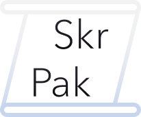

<b>edb.OnGithub</b>
   <a href="the3dbb.github.io">Home</a> • <a href="the3dbb.github.io/projects">Projects</a> • <a href="the3dbb.github.io/contact">Contact Me</a>
   <a href="the3dbb.github.io/SkrPak">SkrPak</a> • <a href="the3dbb.github.io/wiki">SP Wiki</a> • <a href="github.com/the3dbb/SkrPak/issues">Issue Tracker</a>

  

  <a href="https://github.com/the3dbb/SkrPak/releases/download/latest/SkrPak.zip">Download .ZIP</a>

SkrPak is intended to be used by beginners to learn what stuff does. It goes over most everything you need, from variables to loops. It can also be used as a starting point for servers needing a quick gamemode switcher similar to that of Essentials.

## Features
The pack includes skripts such as...
- A gamemode switcher you're already familiar with.
- Time Management (for when you REALLY want daytime).
- Custom Join/Leave messages.
- A fair amount of CHC (Chat Control).
- Playtimes
  - Some servers might struggle due to the constant looping.

Some more Skripts may come at a later date.

## License
The SkrPak is distributed with the MIT License, as is all my other projects.
> Copyright © 2020 the3dbb
>
> Permission is hereby granted, free of charge, to any person obtaining a copy of this software and associated documentation files (the “Software”), to deal in the Software without restriction, including without limitation the rights to use, copy, modify, merge, publish, distribute, sublicense, and/or sell copies of the Software, and to permit persons to whom the Software is furnished to do so, subject to the following conditions:
>
> The above copyright notice and this permission notice shall be included in all copies or substantial portions of the Software.
>
> THE SOFTWARE IS PROVIDED “AS IS”, WITHOUT WARRANTY OF ANY KIND, EXPRESS OR IMPLIED, INCLUDING BUT NOT LIMITED TO THE WARRANTIES OF MERCHANTABILITY, FITNESS FOR A PARTICULAR PURPOSE AND NONINFRINGEMENT. IN NO EVENT SHALL THE AUTHORS OR COPYRIGHT HOLDERS BE LIABLE FOR ANY CLAIM, DAMAGES OR OTHER LIABILITY, WHETHER IN AN ACTION OF CONTRACT, TORT OR OTHERWISE, ARISING FROM, OUT OF OR IN CONNECTION WITH THE SOFTWARE OR THE USE OR OTHER DEALINGS IN THE SOFTWARE.
